# MarkovJunior
MarkovJunior is a probabilistic programming language where programs are combinations of rewrite rules and inference is performed via constraint propagation. MarkovJunior is named after mathematician [Andrey Andreyevich Markov](https://en.wikipedia.org/wiki/Andrey_Markov,_Jr.), who defined and studied what is now called [Markov algorithms](https://en.wikipedia.org/wiki/Markov_algorithm).
<p align="center">

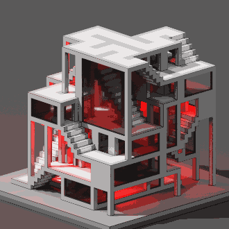
</p>

In its basic form, a MarkovJunior program is an ordered list of rewrite rules. For example, [MazeBacktracker](models/MazeBacktracker.xml) (animation on the left below) is a list of 2 rewrite rules:
1. `RBB=GGR` or "replace red-black-black with green-green-red".
2. `RGG=WWR` or "replace red-green-green with white-white-red".

On each execution step MJ interpreter finds the first rule in the list that has a match on the grid, finds all matches for that rule and applies that rule for a random match. In the [maze backtracker](https://en.wikipedia.org/wiki/Maze_generation_algorithm#Depth-first_search) example, interpreter first applies a bunch of `RBB=GGR` rules. But eventually the green self-avoiding walk gets stuck. At this point the first rule has no matches, so interpreter applies the second rule `RGG=WWR` until the walk gets unstuck. Then it can apply the first rule again, and so on. Interpreter stops when there are no matches for any rule.
<p align="center">
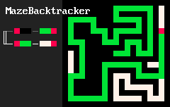
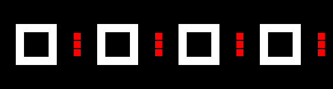
</p>

Probabilistic inference in MarkovJunior allows to impose constraints on the future state, and generate only those runs that lead to the constrained future. For example, inference in Sokoban rules `{RWB=BRW RB=BR}` makes a group of (red) agents organize (white) crates into specified shapes.

Using these ideas, we construct [many probabilistic generators](models/) of dungeons, architecture, puzzles and fun simulations.
<p align="center"><a href="images/top-1764.png"/></a></p>

Additional materials:
1. [Xml syntax overview](syntax.md).
2. Higher resolution screenshots and more seeds: [ModernHouse](https://github.com/mxgmn/Blog/blob/master/ModernHouse.md), [SeaVilla](https://github.com/mxgmn/Blog/blob/master/SeaVilla.md), [Apartemazements](https://github.com/mxgmn/Blog/blob/master/Apartemazements.md), [CarmaTower](https://github.com/mxgmn/Blog/blob/master/CarmaTower.md), [Escheresque](https://github.com/mxgmn/Blog/blob/master/Escheresque.md), [PillarsOfEternity](https://github.com/mxgmn/Blog/blob/master/PillarsOfEternity.md), [Surface](https://github.com/mxgmn/Blog/blob/master/RandomSurface.md), [Knots](https://twitter.com/ExUtumno/status/895688856304992256).
3. Unofficial [technical notes](https://gist.github.com/dogles/a926ab890552cc7e45400a930398449d) by Dan Ogles and [code documentation](https://github.com/kaya3/MarkovJunior-docs) by Andrew Kay.


## Markov algorithms
A Markov algorithm over an alphabet `A` is an ordered list of rules. Each rule is a string of the form `x=y`, where `x` and `y` are words in `A`, and some rules may be marked as halt rules. Application of a Markov algorithm to a word `w` proceeds as follows:
1. Find the first rule `x=y` where `x` is a substring of `w`. If there are no such rules, then halt.
2. Replace the leftmost `x` in `w` by `y`.
3. If the found rule was a halt rule, then halt. Otherwise, go to step 1.

For example, consider this Markov algorithm in the alphabet `{0, 1, x}` (ε is the empty word):
```
1=0x
x0=0xx
0=ε
```
If we apply it to the string `110` we get this sequence of strings:
```
110 -> 0x10 -> 0x0x0 -> 00xxx0 -> 00xx0xx -> 00x0xxxx -> 000xxxxxx -> 00xxxxxx -> 0xxxxxx -> xxxxxx
```
In general, this algorithm converts a binary representation of a number into its unary representation.

Markov's student [Vilnis Detlovs](https://lv.wikipedia.org/wiki/Vilnis_Detlovs) [proved](http://www.mathnet.ru/php/archive.phtml?wshow=paper&jrnid=tm&paperid=1293) that for any Turing machine there exists a Markov algorithm that computes the same function. In comparison, grammars are unordered sets of rewrite rules and L-systems are rewrite rules that are applied in parallel. For more interesting examples of Markov algorithms check [Markov's book](http://www.mathnet.ru/links/1543dd6e347b444e6f3e108fafaf9f2a/tm1178.pdf) or see the greatest common divisor example in the [comment section](https://github.com/mxgmn/test#comments) or [multiplication example](https://en.wikipedia.org/wiki/Markov_algorithm#Description) on Wikipedia.

How would one generalize Markov algorithms to multiple dimensions? First, in multiple dimensions there are no natural ways to insert a string into another string, so the lefts and rights of our rewrite rules should have the same size. Second, there are no natural ways to choose *the leftmost* match. Possible options are:
* Choose a random match. This is what MJ's `(exists)` nodes do.
* Choose all matches. There is a problem with this option however because different matches can overlap and have conflicts. Possible solutions are:
	* Greedily choose a maximal subset of non-conflicting matches. This is what MJ's `{forall}` nodes do.
	* Consider all matches in superposition. That is, instead of separate values, keep waves in each grid cell - boolean vectors that tell which spacetime patterns are forbidden and which are not. And this is how MJ performs inference.

We lose Turing completeness because our new procedure is not deterministic, but practice shows that this formalism still allows to describe a huge range of interesting random processes.


## Rewrite rules
The simplest MarkovJunior program is probably `(B=W)`. It contains just a single rule `B=W`. On each turn, this program converts a random black square into a white square.
<p align="center">
<a href="models/Basic.xml">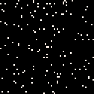</a>
<a href="models/Growth.xml">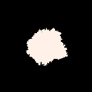</a>
<a href="models/MazeGrowth.xml"></a>
<a href="models/MazeGrowth.xml">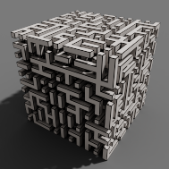</a><br/>
(B=W) | (WB=WW) | (WBB=WAW) | (WBB=WAW)
</p>

[Growth](models/Growth.xml) model `(WB=WW)` is more interesting. On each turn it replaces a black-white pair of adjacent cells `BW` with a white-white pair `WW`. In other words, on each turn it picks a random black cell adjacent to some white cell and color it into white. This model is almost identical to the [Eden growth model](http://digitalassets.lib.berkeley.edu/math/ucb/text/math_s4_v4_article-15.pdf): on each turn both models choose among the same set of black cells. They differ only in probability distributions: a uniform distribution over black cells adjacent to white cells is not the same as a uniform distribution over pairs of adjacent black and white cells.

Model `(WBB=WAW)` generates a maze, with a single line of code! Compare it with an [implementation](https://bl.ocks.org/mbostock/70a28267db0354261476) in a conventional language. Any MarkovJunior model can be run in any number of dimensions without changes. On the right you can see the end result of [MazeGrowth](models/MazeGrowth.xml) in 3d, rendered in [MagicaVoxel](https://ephtracy.github.io/). By default, we use [PICO-8 palette](resources/palette.xml):
<p align="center"></p>

Model `(RBB=WWR)` is a [self-avoiding random walk](https://en.wikipedia.org/wiki/Self-avoiding_walk). Note that self-avoiding walks in 3d are longer on average than in 2d. In general, comparing the behaviors of similar random processes in different dimensions is a fascinating topic. A [classic result](https://sites.math.washington.edu/~morrow/336_19/papers19/Legrand.pdf) of George Pólya says that a random walk in 2d returns to its initial position with probability one, while in 3d this is no longer the case.
<p align="center">
<a href="models/RegularSAW.xml">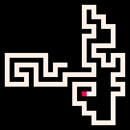</a>
<a href="models/LoopErasedWalk.xml">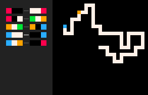</a>
<a href="models/Trail.xml">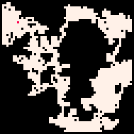</a><br/>
(RBB=WWR) | LoopErasedWalk | (RB=WR RW=WR)
</p>

We can put several rules into one **rulenode**. For example, `(RBB=WWR RBW=GWP PWG=PBU UWW=BBU UWP=BBR)` is a [loop-erased random walk](https://en.wikipedia.org/wiki/Loop-erased_random_walk). Trail model `(RB=WR RW=WR)` generates [decent connected caves](https://blog.jrheard.com/procedural-dungeon-generation-drunkards-walk-in-clojurescript).

Model `(RBB=WWR R*W=W*R)` is known as the [Aldous-Broder maze generation algorithm](http://weblog.jamisbuck.org/2011/1/17/maze-generation-aldous-broder-algorithm). The **wildcard** symbol `*` in the input means that *any* color is allowed to be in the square. The wildcard symbol in the output means that the color doesn't change after the application of the rule. Aldous-Broder algorithm takes much more turns on average to generate a maze than MazeGrowth, for example, but it has a nice property that MazeGrowth doesn't have: each maze has the same probability to be generated. In other words, MazeTrail is an unbiased maze generation algorithm, or it samples mazes (or spanning trees) with the uniform distribution. [Wilson's algorithm](http://web.stanford.edu/~yuvalwig/math/teaching/UniformSpanningTrees.pdf) is a more efficient unbiased maze generation algorithm. Compare its [MarkovJunior](images/Wilson.gif) [implementation](models/Wilson.xml) with an [implementation](https://bl.ocks.org/mbostock/11357811) in a conventional language!


## Combining rulenodes
We can put several rulenodes into a **sequence node**, to be run one after the other. In the [River](models/River.xml) model we first construct a stochastic [Voronoi](models/Voronoi.xml) diagram with 2 sources, and use the boundary between the formed regions as a base for a river. Then we spawn a couple more Voronoi seeds to grow forests and simultaneously grow grass from the river. As a result, we get random river valleys!
<p align="center">
<a href="models/River.xml">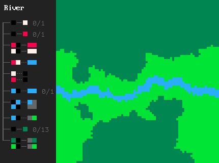</a>
<a href="models/Apartemazements.xml">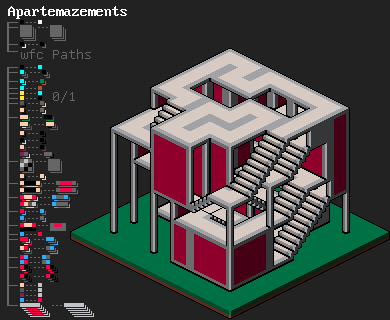</a>
</p>

In [Apartemazements](models/Apartemazements.xml) we start with a WFC node and then do constructive postprocessing with rulenodes:
1. Prepare constraints: mark bottom cells with a separate bottom color, mark the remaining border cells (sides and top) with a separate border color. Border cells should map to Empty, bottom cells should map to all tiles except Down.
2. Run WFC [Paths](resources/tilesets/Paths.xml) tileset to generate closed stairy cycles.
3. Randomize light sources.
4. Drop columns from corners of flat tiles.
5. Retract double columns, columns that touch ground and columns that touch stairs, except columns growing from corners of the Turn tiles.
6. Grow windows between neighboring columns.
7. Merge windows into bigger rectangles. We do this in several steps:
	1. Detect uneven patterns of windows when window corners touch window midpoints.
	2. Mark these patterns and propagate the markings through the whole lengths of window sides.
	3. Merge unmarked pairs of window sides.
8. Turn the remaining 1x1 windows into walls.

A more interesting way to combine nodes is to put them into a **Markov node**. Markov nodes substantially expand what we can do, because they allow to return to past nodes. When a Markov node is active, interpreter finds its first child node that matches and applies it. On the next turn, it finds the first matching node in the list again, and so on. The simplest example of the Markov node use is [MazeBacktracker](models/MazeBacktracker.xml) explained in the top section.

<p align="center">
<a href="models/NystromDungeon.xml">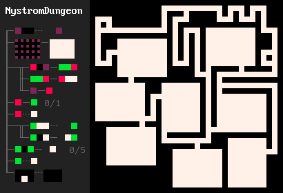</a>
<a href="models/Flowers.xml">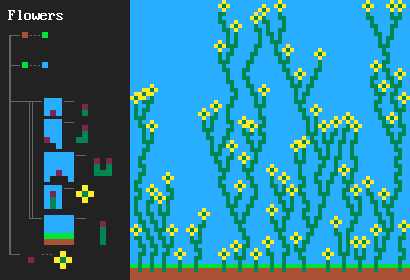</a>
</p>

One of my favorite examples that motivated the development of MarkovJunior is [Bob Nystrom's dungeon generation algorithm](https://journal.stuffwithstuff.com/2014/12/21/rooms-and-mazes/). It goes as follows:
1. Draw a grid `{PBB=**P}`.
2. Spawn a bunch of rooms `(room.png)`.
3. Generate a maze on the rest of the grid. We can use any maze generation algorithm, but [MazeBacktracker](models/MazeBacktracker.xml) is preferred because it produces fewer branching points.
4. Make the resulting configuration of rooms and corridors connected. This can be elegantly done with a Markov node `({GWW=**G}(GBW=*WG))`.
5. Make some additional connections `(GBG=*W* #5)`, so the resulting dungeon has cycles. Dungeons without cycles are pretty boring, since the player has to return through already explored zones.
6. Retract dead ends `{BBB/BWB=BBB/BBB}`.

<p align="center">
<a href="models/Circuit.xml">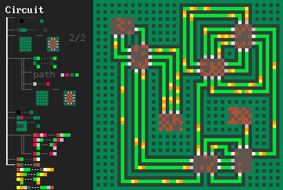</a>
<a href="models/DungeonGrowth.xml">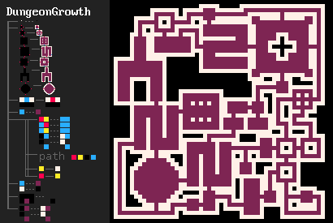</a>
</p>

Like in REFAL, Markov nodes can be nested: once we go into a child node, we ignore outer nodes until the child branch completes.


## Inference
Probabilistic inference in MarkovJunior allows to impose constraints on the future state, and generate only those runs that lead to the constrained future. In other words, inference connects 2 given states (or partially observed states) with a chain of rewrite rules.

The simplest example of inference use is connecting 2 points with a path. In the self-avoiding walk model `(RBB=WWR)` we can **observe** a given square on the grid to become `R` red. Then the interpreter would generate only those walks that lead to the observed square. We can set the interpreter to follow the goal more strictly or less strictly by varying the **temperature** parameter. By default, temperature is set to zero.
<p align="center">
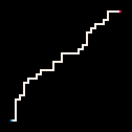
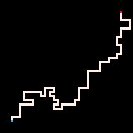
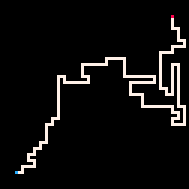
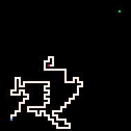<br>
Coldest | Cold | Hot | Hottest
</p>

Another thing we can do is to observe *all* odd grid squares becoming white or red. Then the interpreter would generate self-avoiding walks that cover the entire grid.
<p align="center">
<a href="models/CompleteSAW.xml">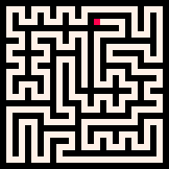</a>
<a href="models/SokobanLevel1.xml">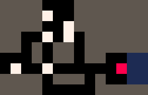</a>
</p>

We can engage inference for any rewrite rules. For example, inference for [stair-drawing rules](models/StairsPath.xml) connects 2 points with a stairy path. Inference for rule `R**/**B=B**/**R` generates paths that a chess knight can take. Inference in the [CrossCountry](models/CrossCountry.xml) model connects 2 points with a path taking terrain costs into account. Inference for the Sokoban ruleset `{RB=BR RWB=BRW}` solves Sokoban puzzles or even [multiagent Sokoban puzzles](images/multisokoban.gif)!
<p align="center">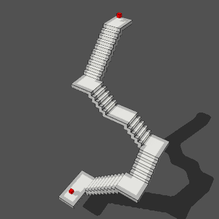</a></p>

Inference in MarkovJunior is done via unidirectional (fast) or bidirectional (slow, but more powerful) constraint propagation. Unidirectional constraint propagation for rewrite rules can be described equivalently in terms of **rule propagation** fields which generalize Dijkstra fields for arbitrary rewrite rules. Dijkstra fields is a popular technique in grid-based procedural generation ([1](https://groups.google.com/forum/#!topic/rec.games.roguelike.development/6yNIuhSerpM), [2](http://www.roguebasin.com/index.php?title=The_Incredible_Power_of_Dijkstra_Maps), [3](http://www.roguebasin.com/index.php?title=Dijkstra_Maps_Visualized)). They in turn generalize [distance fields](https://iquilezles.org/www/articles/distfunctions/distfunctions.htm) used in computer graphics.

If constraint propagation completes it doesn't necessarily mean that the goal state is achievable. But if the propagation fails then we know for sure that the goal is not achievable. This allows to catch states where a crate is pushed to the wrong wall in Sokoban, or where the grid-covering walk splits the grid into 2 disconnected parts. In addition to this boolean heuristic, it's worth looking at the minimal number of turns required for constraint propagation to complete. This integer-valued heuristic is [admissible](https://en.wikipedia.org/wiki/Admissible_heuristic), and we use it in A\* search to sample paths made of rewrite rules between 2 given states.


## Open problems
1. **Program synthesis for procedural generation**. William Chyr's talk ["Level Design in Impossible Geometry"](https://youtu.be/ed2zmmcEryw?t=1298) is not at all about procedural generation, yet I find [one slide](images/ps-for-procgen.jpg) to be very characteristic for pcg practice. William compares his earlier and later approaches to level design. The earlier one produced chaotic levels, while the later approach produced more structured, more intentional levels based on one central idea. Later levels weren't simpler, yet they were more memorable and easier for players to perceive. To me, the left level looks like it was generated procedurally! It has a very similar feel to my [procedural voxel puzzles](https://twitter.com/ExUtumno/status/971031987304763393). Can we make generators that produce levels that are more like the one on the right? This problem may seem AI-complete. But I'd argue it is very similar to classic genetic programming problems like [Koza's lawnmower problem](https://pdfs.semanticscholar.org/555e/13cc2dd246e3d63ceb00590605f3ff59593d.pdf). For example, take a simple procgen task of [generating Hamiltonian paths on the grid](models/CompleteSAW.xml). Even for small grid sizes like 29x29 this task is already computationally demanding. But do we really need to sample from all possible paths in practice? If we give this task to a human, they would probably draw a spiral or a zigzag curve - these are much more memorable and intentional designs than a random Hamiltonian path, plus they generalize to any grid sizes. To summarize, we can ask the system either to find a random Hamiltonian path or to find a short program that generates Hamiltonian paths. In the first case the result would look like the left level on the slide, and in the second case like the right level. Solving the latter program synthesis problem would create more memorable and intentional generators.
2. **Model synthesis from examples**. Markov algorithms seem to be a perfect environment for program/model synthesis: no variables, ifs or whiles, nodes can be easily moved around without breaking correctness, models are easy to make differentiable. Random MJ programs are often fun and can produce human-relatable results and behaviors.
	1. Can we synthesize a MJ model from a result, or a set of results?
	2. Given a maze, is it possible to determine (or assign probabilities) whether it was generated by [MazeGrowth](models/MazeGrowth.xml) or [MazeBacktracker](models/MazeBacktracker.xml)?
	3. Solve the [Abstraction and Reasoning Challenge](https://www.kaggle.com/c/abstraction-and-reasoning-challenge) by inferring MarkovJunior models. Adjoint problem: use insights from the ARC challenge to build a better DSL for procedural generation on a grid.
3. **Custom algorithms that run in the wave space**. To unite the advantages of constructive and constrained-based procedural generation. Related: custom algorithms (MJ rewrite rules) with custom energy functions like Ising energy or ConvChain energy.
4. Generalize the notion of a pattern.
5. Investigate MJ-like processes on other (possibly nonregular) grids or arbitrary graphs.
6. Experiment with interactive extensions of Markov algorithms. It's possible to turn any MJ model into a game by assigning specific rewrite rules or nodes to key presses.
7. Push the state of the art in grid-based procedural generation. [ModernHouse](https://twitter.com/ExUtumno/status/1141354217774428160) does not yet reach the structural variety of human-designed houses like [Sims 2 houses](https://www.thesimsresource.com/downloads/browse/category/sims2-lots/featured/1/search/modern%20house/). Use more subtle constraints.


## Comments
Compared to Turing machines and lambda calculus, Markov algorithms is probably the shortest and simplest way to rigorously define what an algorithm is.

Exercise: prove that the following Markov algorithm finds the greatest common divisor of 2 numbers written in a unary representation. For example, if we apply it to `111111*1111111111` we get `11`.
```
1a=a1
1*1=a*
1*=*b
b=1
a=c
c=1
*=ε (halt)
```

Fast pattern matching. MarkovJunior interpreter samples matches uniformly, but it doesn't scan the whole grid every turn. To keep pattern matching fast, the interpreter remembers previously found matches and searches only around the places that got changed. When a rulenode is encountered for the first time, MJ interpreter uses a multidimensional version of the [Boyer–Moore algorithm](https://en.wikipedia.org/wiki/Boyer%E2%80%93Moore_string-search_algorithm).

Stochastic relaxation. Markov nodes have a very nice representations as limits of differentiable nodes. Consider an unordered set of rewrite rules where each rule `r` is assigned a weight `w(r)`. On each step the interpreter finds all matches for all rules and chooses a random match according to the Boltzmann distribution `p(r) ~ exp(-w(r)/t)`. Then in the freezing limit `t->0` we get a Markov node, ordered by weights. What's good about this construction, is that for any `t>0` and for a typical score function, score's average on multiple runs would be a continuous (and smooth for practical purposes) function of weights. This means that one can find the optimal weights by gradient descent and then freeze the system to get the final discrete program.

Read this [essay](https://www.jstor.org/stable/27641983) by [Boris Kushner](https://en.wikipedia.org/wiki/Boris_Kushner_(mathematician)) about A. A. Markov and his work in constructive mathematics.


## Used work
Main used work:
1. Andrey A. Markov, [The Theory of Algorithms](http://www.mathnet.ru/php/archive.phtml?wshow=paper&jrnid=tm&paperid=1117&option_lang=eng), 1951. Markov used these ideas earlier in 1947 in his proof of the algorithmic undecidability of the word problem in semigroups. See also a later [book](http://www.mathnet.ru/php/archive.phtml?wshow=paper&jrnid=tm&paperid=1178&option_lang=eng) with a more detailed treatment. I would be grateful for links to English translations in open access.
2. Guilherme S. Tows, [Imagegram](https://zaratustra.itch.io/imagegram), 2009. MarkovJunior takes forall-nodes from Imagegram.
3. Valentin Turchin, [REFAL language](http://fprog.ru/2011/issue7/practice-fp-7-screen.pdf), 1968. MJ takes the idea of nested Markov nodes from REFAL.
4. Brian Walker et al., [The incredible power of Dijkstra maps](https://groups.google.com/forum/#!topic/rec.games.roguelike.development/6yNIuhSerpM), 2010. A discussion in the the roguelike community that contains many techniques of using Dijkstra maps/distance fields for procedural generation and NPC AI. Later writeups: [1](http://www.roguebasin.com/index.php?title=The_Incredible_Power_of_Dijkstra_Maps), [2](http://www.roguebasin.com/index.php?title=Dijkstra_Maps_Visualized). We generalize Dijkstra maps to arbitrary rewrite rules.
5. Pavlos S. Efraimidis, Paul Spirakis, [Weighted Random Sampling](https://utopia.duth.gr/~pefraimi/research/data/2007EncOfAlg.pdf), 2005.
6. Work used in custom nodes: [Model Synthesis](http://graphics.stanford.edu/~pmerrell/thesis.pdf), [Wave Function Collapse Algorithm](https://github.com/mxgmn/WaveFunctionCollapse), [ConvChain Algorithm](https://github.com/mxgmn/ConvChain).
7. Classic algorithms: [constraint propagation](https://en.wikipedia.org/wiki/Local_consistency), [constraint solving algorithms](https://www.cs.ubc.ca/~mack/Publications/AI77.pdf), [graph traversal](https://en.wikipedia.org/wiki/Graph_traversal), [A* search](https://www.cs.auckland.ac.nz/courses/compsci709s2c/resources/Mike.d/astarNilsson.pdf).

Related work:
1. Daniel Ritchie, [Probabilistic Programming for Procedural Modeling and Design](https://dritchie.github.io/pdf/thesis.pdf), 2016.
2. Lingfeng Yang, [From Execution Traces to Specialized Inference](https://stacks.stanford.edu/file/druid:kq822ym0815/et2si-reduced-opt-augmented.pdf), 2015.

Sources of examples:
1. [BasicKeys](models/BasicKeys.xml) and [Keys](models/Keys.xml) are adaptations of graph grammars formulated by Joris Dormans, [Engineering Emergence: Applied Theory for Game Design](https://www.illc.uva.nl/Research/Publications/Dissertations/DS-2012-12.text.pdf), 2012. Which in turn are development of the earlier work by David Adams, [Automatic Generation of Dungeons for Computer Games](https://pdfs.semanticscholar.org/2502/0f8d955aee07b7dd49a3ec23b1f2a8cf1d06.pdf), 2002. I use a variation of these models to generate key-lock-bridge puzzles in [SeaVilla](models/SeaVilla.xml).
1. [CarmaTower](models/CarmaTower.xml) is a proceduralization of a [voxel scene](https://twitter.com/Sir_carma/status/851883489628704768) by Antoine Lendrevie.
1. The [NystromDungeon](models/NystromDungeon.xml) model is a MarkovJunior port of [Bob Nystrom's dungeon generator](https://journal.stuffwithstuff.com/2014/12/21/rooms-and-mazes/).
1. [HamiltonianPath](models/HamiltonianPath.xml) algorithm is adapted from [this](http://aip.scitation.org/doi/pdf/10.1063/1.443937) article. Compare it with an [implementation](http://clisby.net/projects/hamiltonian_path/hamiltonian_path_v1.html) in a conventional language.
1. Room shapes in [DungeonGrowth](models/DungeonGrowth.xml) are taken from the [r/proceduralgeneration post](https://old.reddit.com/r/proceduralgeneration/comments/3pa8a1/my_take_at_a_roguelike_level_generator_ft/). Note that MJ interpreter automatically performs the optimizations described in the post.
1. The [Wilson](models/Wilson.xml) model is a rewrite rule formulation of the [Wilson's algorithm](https://en.wikipedia.org/wiki/Loop-erased_random_walk#Uniform_spanning_tree). Compare it with an [implementation](https://bl.ocks.org/mbostock/11357811) in a conventional language.
1. [MazeGrowth](models/MazeGrowth.xml) model is also known as maze generation via random traversal. Compare it with an [implementation](https://bl.ocks.org/mbostock/70a28267db0354261476) in a conventional language.
1. [Growth](models/Growth.xml) is closely related to the [Eden growth model](http://digitalassets.lib.berkeley.edu/math/ucb/text/math_s4_v4_article-15.pdf).
1. [BernoulliPercolation](models/BernoulliPercolation.xml) is a well studied model in a [percolation theory](https://en.wikipedia.org/wiki/Percolation_theory).
1. [NestedGrowth](models/NestedGrowth.xml) is taken from [Imagegram](https://zaratustra.itch.io/imagegram).
1. [SmoothTrail](models/SmoothTrail.xml) is adapted from [128_mhz's tweet](https://twitter.com/128_mhz/status/953847394403205120).
1. [SokobanLevel1](models/SokobanLevel1.xml) seems to be the first level from Hiroyuki Imabayashi's Sokoban puzzle. [SokobanLevel2](models/SokobanLevel2.xml) is the [level 452](https://www.sokobanonline.com/play/web-archive/razorflame/ionic-catalysts-xi/58022_ionic-catalysts-xi-452) from Ionic Catalysts XI set.
1. [RainbowGrowth](models/RainbowGrowth.xml) was [proposed](https://github.com/mxgmn/MarkovJunior/discussions/25) by [mure](https://github.com/mure).
1. [MultiHeadedWalk](models/MultiHeadedWalk.xml), [MultiHeadedDungeon](models/MultiHeadedDungeon.xml) and [MultiHeadedWalkDungeon](models/MultiHeadedWalkDungeon.xml) are [based](https://github.com/mxgmn/MarkovJunior/discussions/38) on the idea by [Ilya Kudritsky](https://github.com/Inferdy).
1. [Island](models/Island.xml) model is by [Guillaume Fiette](https://github.com/woldendans/MJ-simple-island).
1. [LostCity](models/LostCity.xml), [Forest](models/Forest.xml) and [Texture](models/Texture.xml) models are based on the model by [Andrew Kay](https://github.com/kaya3/pattern-match-2d).

Voxel scenes were rendered in [MagicaVoxel](https://ephtracy.github.io/) by [ephtracy](https://github.com/ephtracy). Special thanks to [Brian Bucklew](https://github.com/unormal) for demonstrating the power of Dijkstra fields to me in roguelike level generation and [Kevin Chapelier](https://github.com/kchapelier) for a number of good suggestions. The font used in GUI is [Tamzen](https://github.com/sunaku/tamzen-font).


## How to build
MarkovJunior interpreter is a console application that depends only on the standard library. Get [.NET Core](https://dotnet.microsoft.com/download) for Windows, Linux or macOS and run
```
dotnet run --configuration Release MarkovJunior.csproj
```
Alternatively, download and run the latest [release](https://github.com/mxgmn/MarkovJunior/releases) for Windows.

Generated results are put into the `output` folder. Edit `models.xml` to change model parameters. Open `.vox` files with [MagicaVoxel](https://ephtracy.github.io/).


## Notable ports, forks and spinoffs
* Yuu made a [TypeScript version of MarkovJunior](https://github.com/Yuu6883/MarkovJuniorWeb) that [runs on the web](https://yuu6883.github.io/MarkovJuniorWeb/), extended the language and added the ability to bind nodes to keypresses.
* Aseaday is [porting](https://github.com/aseaday/MarkovJunior.js) MarkovJunior to JavaScript.
* Andrew Kay added [XML documentation](https://github.com/kaya3/MarkovJunior-docs) to C# source code.
* [Dan Ogles](https://github.com/dogles) wrote MarkovJunior [technical notes](https://gist.github.com/dogles/a926ab890552cc7e45400a930398449d) with the focus on fields and inference.
* Andrew Kay designed [MJr](https://github.com/kaya3/MJr), a compiled language based on pattern rewriting.


## Funding
MarkovJunior development was [funded](https://github.com/users/mxgmn/sponsorship) by
1. **[Embark Studios](https://www.embark-studios.com/)**
2. [Oskar Stålberg](https://twitter.com/OskSta)
3. [Freehold Games](https://store.steampowered.com/app/333640/Caves_of_Qud/)
4. [Bob Burrough](https://bobburrough.com/)
